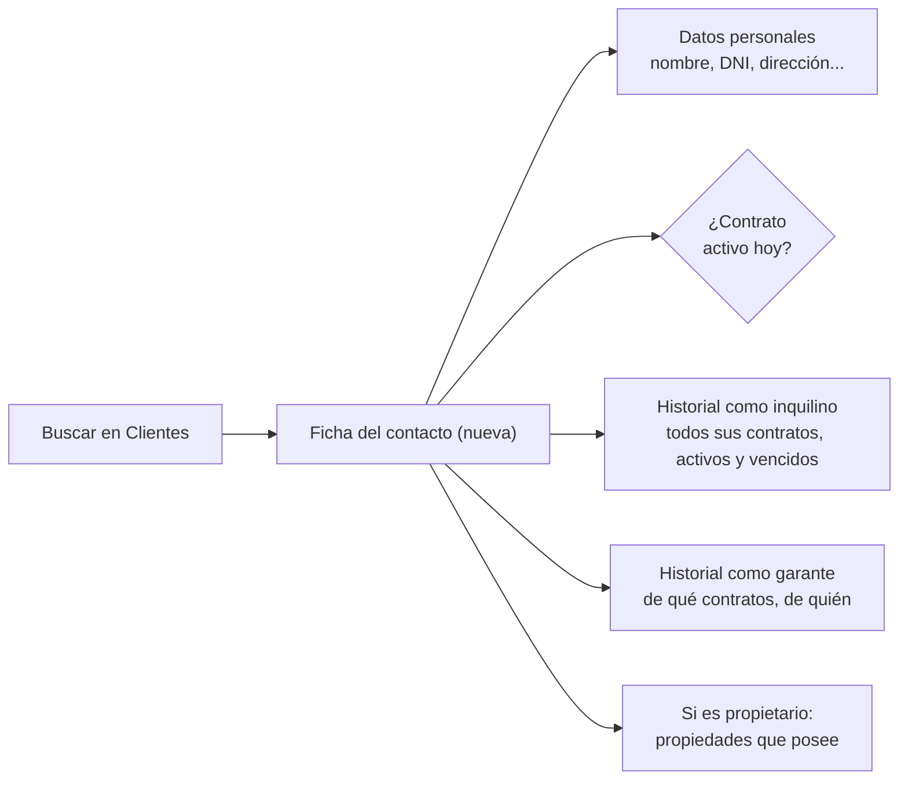
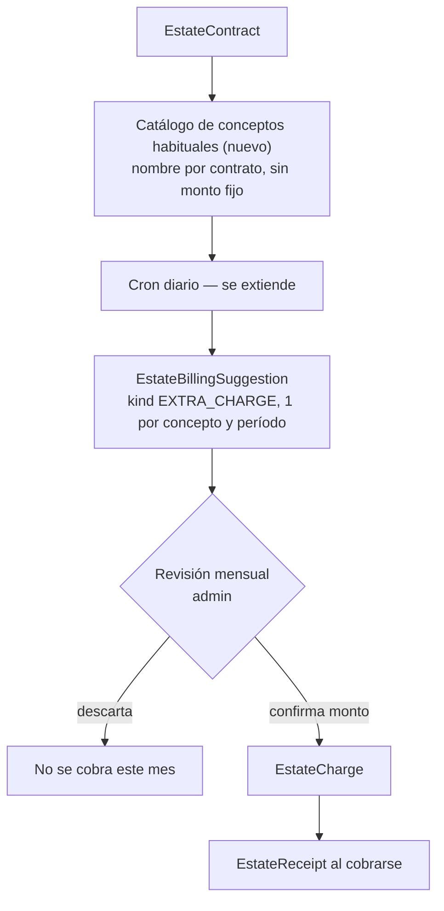

# Plan de desarrollo — Gastos recurrentes y portal del inquilino

## Estado

**Las cinco etapas (0 a 4) ya están implementadas y probadas de punta a punta.** Este documento queda como referencia de diseño — las decisiones que quedaron "a confirmar" más abajo se resolvieron así:

- Monto de los gastos recurrentes: **variable mes a mes**, se revisa a mano antes de generar el cobro (no quedó fijo como decía la recomendación original).
- Alta al portal: **híbrida** — el admin habilita el contacto y carga su DNI (`EstateContact.portalEnabled` + `taxId`), y el inquilino se auto-registra cruzando email + DNI en `/mi-alquiler/activar`, sin mail de invitación.
- Pago online: fuera de esta etapa, como estaba recomendado.
- Recordatorio por mail: sí, implementado (`EstateCharge.reminderSentAt`, cron 6.5).

## Alcance

Este documento propone tres features sobre el módulo de **contratos de alquiler** (`EstateContract` / `EstateContact`) de UrbIA:

1. Una ficha propia de contacto con su legajo completo: todo su historial como inquilino y como garante, tenga o no un contrato activo hoy.
2. Un mecanismo para que la inmobiliaria le sume al inquilino, junto con el alquiler, conceptos adicionales que varían mes a mes (expensas, ABL, tasas, servicios).
3. Un portal de autogestión donde el inquilino se registra y ve lo que tiene que pagar.

La ficha de contacto (punto 1) es la base de los otros dos: para invitar a alguien al portal o para saber a quién facturarle, primero hay que poder buscarlo en Clientes y ver de un vistazo quién es.

Es un plan técnico y funcional. No implica que las funcionalidades descriptas estén implementadas actualmente.

**Fuera de alcance explícito**: este documento no toca nada de administración de consorcios ni expensas edilicias (`EstateBuilding` / `EstateUnit`). Ese es un desarrollo aparte, con su propio plan en `docs/plan-administracion-consorcios.md`. Los dos módulos comparten la tabla `EstateCharge`, pero por diseño actual una obligación pertenece a un contrato de alquiler **o** a una unidad de consorcio, nunca a ambos — esta propuesta no cambia esa separación.

La propuesta conserva la arquitectura del SaaS, el aislamiento multi-tenant, la autenticación, el motor de cobranzas y la infraestructura de mail existentes.

## Diagnóstico actual

UrbIA ya dispone de una base de cobranzas de alquiler:

- Cron diario (`src/app/api/cron/estate-billing/route.ts`) que genera automáticamente la cuota de **Alquiler** de cada contrato activo como `EstateCharge`, y calcula punitorios si corresponde.
- `EstateCharge.concept` es texto libre — hoy solo se usa para "Alquiler" y "Punitorios"; un admin podría cargar otro concepto a mano, pero no hay catálogo ni repetición automática.
- Cola de revisión (`EstateBillingSuggestion`) ya usada para las actualizaciones de alquiler por índice: el cron nunca cambia el monto del contrato solo, siempre deja una sugerencia pendiente de aprobación manual. Este mecanismo de "se sugiere, un humano confirma o descarta" es la pieza más importante a reutilizar.
- `EstateReceipt` registra cobros manuales ya recibidos (transferencia o efectivo). No hay cobro online.
- `EstateContractDocument.visibility` ya distingue `AGENCY_ONLY | TENANT | OWNER | BOTH_PARTIES`, pero es metadata sin uso: no existe ningún portal que la lea.
- `EstateContact` (donde vive el inquilino) no tiene ningún vínculo con `User` (la cuenta de login) — son tablas separadas hoy. `EstateContact.taxId` (DNI/CUIT) ya existe como campo.
- No hay ningún sistema de recordatorio de vencimiento por mail.
- `EstateContact` hoy guarda: `name`, `email`, `phone`, `taxId`, `roles` (array libre: `OWNER | PROSPECT | TENANT | BUYER | GUARANTOR`) y `notes`. **No tiene dirección** ni ningún otro dato personal.
- `EstateContact` ya tiene, sin usar todavía para mostrar un historial: `contracts` (contratos donde es inquilino), `guarantorOf` (contratos donde es garante), `ownedProperties` (si es propietario). Los tres vínculos existen en el schema desde hoy — falta la pantalla que los junte y los muestre.
- Clientes (`/admin/gestion/clientes`) todavía no tiene ficha propia por contacto: es la misma lista genérica con edición inline que tenían Contratos y Consultas antes de esta sesión. Al entrar a un contacto no se ve nada de su historial.

## Criterio central

**Ficha del contacto**: un contacto no es solo lo que está pasando ahora — es todo lo que pasó. Al buscar a alguien en Clientes y entrar a su ficha, la inmobiliaria tiene que ver de una: si tiene un contrato activo hoy, todos sus contratos anteriores (aunque hayan terminado), y todos los contratos donde fue garante de otra persona. Nada de esto se borra ni se archiva — el legajo queda para siempre, sea o no cliente activo hoy.



**Gastos adicionales**: no son un monto que varía, son un **conjunto que varía**. Un mes el contrato puede sumar tres conceptos (expensas, ABL, tasa municipal), al mes siguiente dos, y al otro ninguno. Por eso no se generan solos como el alquiler — cada período se arma una revisión, igual que ya existe para la actualización de alquiler, donde alguien de la inmobiliaria elige qué conceptos aplican este mes y cuánto sale cada uno, antes de que se conviertan en cobro.



**Portal del inquilino**: alta en dos pasos, uno de la inmobiliaria y uno del inquilino. La inmobiliaria habilita el acceso y confirma el DNI en la ficha del contacto; el inquilino se auto-registra cruzando email + DNI contra ese dato, sin depender de que la inmobiliaria le mande un link por mail cada vez.

```mermaid
flowchart LR
    EC[EstateContact\ntaxId ya cargado] -->|admin marca\n"habilitado para portal"| HAB[Contacto habilitado]
    HAB --> REG["Inquilino se registra solo\ningresa email + DNI"]
    REG -->|coincide con EstateContact| USR["User nuevo\n+ contactId"]
    USR --> LOGIN[Define su contraseña ahí mismo]
    LOGIN --> PORTAL[/mi-alquiler]
    PORTAL --> CONTR[Sus contratos]
    PORTAL --> CARGOS[Cargos: pagado / pendiente / vencido]
    PORTAL --> DOCS["Documentos con visibility\nTENANT o BOTH_PARTIES"]
```

## Modelo de datos propuesto

### 0. Ficha del contacto (legajo)

**Campos nuevos en `EstateContact`** — hoy solo tiene nombre, email, teléfono, DNI/CUIT y notas:

- `address` (dirección): es el que falta explícitamente hoy.
- `birthDate` (fecha de nacimiento): se suele pedir para el cuerpo del contrato y para la garantía.
- `occupation` (ocupación / lugar de trabajo): relevante sobre todo para evaluar a un garante — hoy no hay ningún dato de solvencia más allá de `guaranteeType` en el contrato.

Los tres son opcionales y de texto libre, mismo criterio que el resto de la ficha — se pueden recortar o ampliar antes de construir, es una propuesta de punto de partida.

**Ficha dedicada** `/admin/gestion/clientes/[id]` (hoy no existe — Clientes sigue en la lista genérica con edición inline). Mismo patrón que ya se usa en Propiedades y Contratos: formulario arriba, secciones de historial abajo, todo dentro de la misma página. No hace falta ningún modelo nuevo para el historial — los tres vínculos ya existen en el schema:

- **Contratos como inquilino** (`EstateContact.contracts`): lista completa, con estado (`ACTIVE`, `ENDED`, etc.), propiedad y período — de un vistazo se ve si tiene algo activo hoy.
- **Contratos como garante** (`EstateContact.guarantorOf` → `EstateContractGuarantor` → contrato): de qué contratos fue garante y quién era el inquilino en cada uno.
- **Propiedades propias** (`EstateContact.ownedProperties`), si el contacto tiene el rol `OWNER`.

Como los tres vínculos ya están en el modelo actual, esta pieza es casi enteramente de pantalla — la parte más rápida de construir de todo este plan.

### 1. Catálogo de conceptos habituales por contrato

Modelo nuevo, por ejemplo `EstateContractChargeConcept`:

- `contractId`: a qué contrato pertenece.
- `name`: "Expensas", "ABL", "Tasa municipal" — texto libre, mismo criterio que `EstateCharge.concept` hoy.
- `active`: se puede pausar sin perder el historial de meses anteriores.
- `lastAmount` / `lastCurrency` (opcional): último monto cargado, solo para precargar la sugerencia del mes siguiente y ahorrar tipeo — nunca se usa para cobrar solo.

No guarda un monto fijo. Es la lista de "esto suele aplicar a este contrato", no una orden de cobro.

### 2. Revisión mensual (reutiliza `EstateBillingSuggestion`)

Se agrega un nuevo valor de `kind`, por ejemplo `EXTRA_CHARGE`, con `payload` conteniendo `{ concept, amount, currency }`. El cron, al mismo tiempo que genera el alquiler del período, crea una sugerencia por cada concepto activo del contrato (monto sugerido = `lastAmount` si existe, vacío si no). La pantalla de revisión (extiende `BillingSuggestionsPanel`, que ya existe) le permite a la inmobiliaria, por cada sugerencia:

- Cargar o ajustar el monto y aprobar → crea el `EstateCharge` del período, mismo circuito que el alquiler.
- Descartar → no se cobra ese concepto ese mes, sin borrar el concepto del catálogo.

### 3. Puente inquilino → portal

- `User`: se agrega `contactId` (FK opcional a `EstateContact`). Un usuario con `contactId` es un inquilino con acceso al portal, no un admin ni un cliente de la tienda.
- `EstateContact`: se agrega un flag explícito (por ejemplo `portalEnabled`), distinto de tener el rol `TENANT` — habilitar el portal es una acción deliberada de la inmobiliaria, no automática por el rol.
- Nueva pantalla de auto-registro (`/mi-alquiler/activar` o similar): el inquilino ingresa email + DNI. El servidor busca un `EstateContact` de ese tenant con `portalEnabled = true`, ese email y ese `taxId`, sin `User` ya vinculado. Si coincide, crea el `User` y deja elegir contraseña ahí mismo — sin depender de un mail de invitación para este paso.
- `/mi-alquiler`: requiere sesión con `contactId`, lista los contratos del contacto (`EstateContact.contracts`, relación que ya existe), el detalle de `EstateCharge` de cada uno con su saldo, y los `EstateContractDocument` cuya `visibility` sea `TENANT` o `BOTH_PARTIES` — primer lector real de un campo que hoy existe sin uso.

### 4. Recordatorio de vencimiento

Se extiende el cron de cobranzas: unos días antes del `dueAt` de un `EstateCharge` con contrato vinculado a un `User` de portal, se envía un mail simple con el detalle y el vencimiento, reusando `sendMail` y agregando una plantilla nueva en `email-templates.ts` (mismo patrón que la de invitación de administrador).

## Fuera de alcance de esta etapa

- **Pago online** (Mercado Pago u otro medio): el portal muestra el saldo, no cobra. `EstateContract.paymentMethod` ya tiene la opción `MERCADOPAGO` en el catálogo, pero sin integración real detrás — queda como una etapa aparte, más grande (SDK, webhook, conciliación).
- **Todo lo de consorcios/expensas edilicias**: ver `docs/plan-administracion-consorcios.md`. No se comparte modelo de datos entre ambos.
- **Liquidación al propietario**: este plan es la cara "inmobiliaria → inquilino", no "inmobiliaria → propietario".

## Plan por etapas

### Etapa 0 — Ficha del contacto

Campos nuevos en `EstateContact` (dirección y los que se confirmen) + ficha dedicada `/admin/gestion/clientes/[id]` con el historial de contratos e historial como garante. No requiere modelos nuevos, es la base para poder invitar a alguien al portal con confianza de quién es.

### Etapa 1 — Conceptos y revisión mensual (sin portal)

Catálogo de conceptos por contrato, extensión del cron para generar sugerencias `EXTRA_CHARGE`, y la revisión mensual en el panel existente. Ya deja de depender de cargar cada concepto a mano desde cero — el resto de Cobranzas (registro de cobro, anulación) no cambia.

### Etapa 2 — Puente de acceso

Campo `contactId` en `User`, flag `portalEnabled` en `EstateContact`, pantalla de auto-registro por email + DNI.

### Etapa 3 — Portal de consulta

`/mi-alquiler`: contratos, cargos con saldo, documentos visibles para el inquilino.

### Etapa 4 — Recordatorio por mail

Extensión del cron + plantilla de mail de vencimiento próximo.

### Etapa futura (fuera de este plan)

Pago online desde el portal, una vez validadas las etapas anteriores con uso real.
