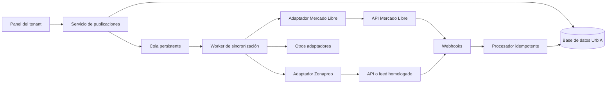

# Plan de integración con portales inmobiliarios

**Estado:** investigación y propuesta. No implementado.  
**Fecha:** 18 de septiembre de 2026.  
**Objetivo:** que cada inmobiliaria cargue y mantenga una propiedad una sola vez en UrbIA y pueda publicarla, actualizarla o retirarla de portales externos desde el mismo panel.

## 1. Resumen ejecutivo

La integración debe diseñarse como un módulo multi-tenant de distribución de avisos:

- **UrbIA será la fuente principal** de los datos de la propiedad.
- Cada tenant conectará sus propias cuentas y planes de los portales.
- Una propiedad podrá enviarse a uno o varios portales, cada uno con configuración y estado independientes.
- Los cambios en UrbIA generarán una nueva sincronización sin volver a cargar el aviso.
- Las consultas y métricas se importarán cuando el portal disponga de API o webhook para ello.
- La arquitectura usará adaptadores por portal, porque categorías, atributos, autenticación y ciclo de vida no son iguales entre proveedores.

La primera implementación aconsejada es **Mercado Libre Inmuebles**, porque tiene documentación pública para OAuth, publicación, actualización, imágenes, paquetes, consultas y notificaciones. La incorporación de **Zonaprop** debe comenzar por una gestión comercial y técnica con el portal: no encontré documentación pública argentina que permita asegurar hoy un alta directa por API. Existe documentación oficial del Grupo OLX para integración mediante feed XML en otros mercados, pero no debe asumirse que el mismo contrato o formato habilita Zonaprop Argentina.

No se recomienda automatizar navegadores ni hacer scraping para publicar. Es frágil, puede romperse sin aviso y puede incumplir las condiciones del portal.

## 2. Qué existe hoy en UrbIA

El modelo actual ya resuelve una parte importante:

- `Tenant`: aislamiento de cada inmobiliaria.
- `EstateProperty`: código interno, título, descripción, tipo, dirección, ciudad, barrio, dormitorios, baños, cocheras, superficies, coordenadas, propietario, emprendimiento, publicación web y destacados.
- `EstateListing`: oferta comercial separada por operación, moneda, precio, alquiler temporario, contacto y estado.
- `EstateMedia`: imágenes asociadas a la propiedad.
- `EstateDevelopment`: emprendimientos vinculables a propiedades.
- `EstateInquiry`: consultas propias del sitio.
- autenticación, roles, configuración por tenant, almacenamiento de imágenes y auditoría.

Esto permite construir la integración sin copiar la arquitectura de ningún portal. Sin embargo, los datos actuales no alcanzan para completar todos los atributos obligatorios de los portales.

## 3. Investigación de canales

### 3.1 Mercado Libre Inmuebles

Es el candidato adecuado para el primer adaptador:

- usa OAuth 2.0 server-side;
- permite crear avisos mediante `POST /items`;
- dispone de categorías y atributos consultables, que deben tratarse como catálogos externos dinámicos;
- maneja ubicación, fotos, videos, recorridos, paquetes y niveles de destaque;
- permite actualizar y finalizar publicaciones;
- ofrece notificaciones y funciones para preguntas, leads y estadísticas;
- exige que la cuenta de la inmobiliaria tenga un paquete de publicaciones con cupos;
- su programa de partners exige, entre otras cosas, publicación y actualización, fotos, ubicación, carga masiva, paquetes, calidad, penalizaciones, notificaciones y consultas.

La aplicación deberá solicitar acceso como integrador y cumplir el proceso de homologación. No alcanza con desarrollar el código.

Fuentes oficiales:

- [Programa para desarrolladores de vehículos e inmobiliarias](https://developers.mercadolibre.com.ar/es_ar/developer-partner-program-vehiculos-inmobiliarias)
- [Publicación de inmuebles](https://developers.mercadolibre.com.ar/esa/publica-inmueble)
- [Categorías y atributos](https://developers.mercadolibre.com.ar/es_ar/producto-autenticacion-autorizacion/categorias-atributos-inmuebles)
- [Ubicación de inmuebles](https://developers.mercadolibre.com.ar/es_ar/envio/localizar-inmuebles)
- [Paquetes y cupos](https://developers.mercadolibre.com.ar/productos-recibe-notificaciones/gestionar-paquetes-de-inmuebles)
- [Notificaciones](https://developers.mercadolibre.com.ar/es_ar/productos-recibe-notificaciones)
- [Desarrollos inmobiliarios](https://developers.mercadolibre.com.ar/es_ar/mercadoenvios-modo-1/desarrollos-inmobiliarios)

### 3.2 Zonaprop

El caso deseado es viable como concepto, pero antes de programarlo hay que confirmar con Zonaprop:

1. si admite nuevos integradores/CRM en Argentina;
2. si la entrega se realiza por API, feed XML, FTP/HTTPS u otro mecanismo;
3. formato y catálogo vigente;
4. frecuencia de lectura y forma de reportar errores;
5. forma de alta y baja de avisos;
6. recepción de consultas y métricas;
7. homologación, entorno de prueba y condiciones comerciales.

Como antecedente, el Grupo OLX documenta oficialmente un esquema de feed XML para actualizaciones masivas desde CRMs, procesado periódicamente y con reportes por email, webhook y panel. Esa documentación incluye formatos VRSync/ZAP, validador y reportes, pero está orientada a las marcas y mercados cubiertos por ese programa. Sirve como referencia de arquitectura, no como confirmación contractual para Zonaprop Argentina.

Fuente oficial de referencia:

- [Integración de feeds del Grupo OLX](https://developers.grupozap.com/feeds/integration.html)
- [Catálogo técnico de feeds](https://developers.grupozap.com/feeds/)

### 3.3 Argenprop y otros portales

No se debe presupuestar un adaptador hasta obtener documentación y autorización formal. Para cada portal habrá una ficha de viabilidad con:

- método de integración;
- alta como proveedor homologado;
- credenciales por tenant o por integrador;
- contratos y costos;
- campos obligatorios;
- frecuencia y límites;
- soporte de altas, cambios y bajas;
- retorno de consultas y métricas;
- ambiente de pruebas y SLA.

El diseño propuesto permite agregar después Argenprop, Properati u otros sin modificar la lógica central de propiedades.

## 4. Experiencia de usuario propuesta

### 4.1 Sección “Portales”

Dentro de **Inmobiliaria > Gestión > Portales**:

- tarjetas por portal: conectado, pendiente, vencido, con errores o desconectado;
- botón “Conectar cuenta” mediante OAuth cuando exista;
- instrucciones y URL del feed cuando el portal use archivos;
- plan contratado, cupos disponibles y última sincronización cuando la API lo permita;
- selección de contacto/agente predeterminado;
- reglas predeterminadas: tipo de aviso, destaque y política de ubicación exacta;
- botón para probar conexión y sincronizar catálogos.

Cada conexión pertenece obligatoriamente a un `tenantId`. Un usuario nunca puede ver ni usar credenciales de otra inmobiliaria.

### 4.2 Dentro de una propiedad

Agregar una pestaña **Publicación en portales**:

- un interruptor por portal;
- estado: borrador, lista para publicar, pendiente, publicada, requiere corrección, pausada o finalizada;
- vista previa de título, operación, precio, ubicación e imágenes que se enviarán;
- tipo de publicación o destaque;
- validación previa con errores concretos: “Falta antigüedad”, “El portal requiere provincia”, etc.;
- botón “Publicar” o “Actualizar ahora”;
- URL pública e identificador externo;
- fecha de última sincronización;
- historial de intentos y respuesta legible del portal.

Al guardar una propiedad publicada, UrbIA deberá informar que hay cambios pendientes y sincronizarlos en segundo plano. No conviene hacer que el guardado espere la respuesta de varios portales.

### 4.3 Bandeja operativa

Vista general para la inmobiliaria:

- publicaciones activas por portal;
- pendientes de sincronización;
- rechazadas o penalizadas;
- propiedades incompletas;
- cupos disponibles;
- credenciales próximas a vencer o desconectadas;
- últimas consultas recibidas;
- filtro por agente, sucursal, operación y portal.

## 5. Reglas de sincronización

### Fuente de verdad

UrbIA manda sobre contenido, precio, imágenes y disponibilidad. Los cambios manuales hechos en el portal podrían ser sobrescritos en la siguiente sincronización. Esta regla debe aparecer claramente en la interfaz.

Los datos propios del portal, como calidad, penalización, consumo de cupo, métricas y estado de moderación, se importan y no se sobrescriben.

### Acciones

- **Publicar:** crea el aviso y guarda su ID externo.
- **Actualizar:** envía solo cuando cambió el contenido relevante.
- **Pausar:** mantiene el vínculo, pero detiene la exposición.
- **Reactivar:** vuelve a activar si el portal y el cupo lo permiten.
- **Finalizar:** retira definitivamente según las reglas del portal.
- **Desvincular:** deja de sincronizar sin borrar a ciegas la publicación externa; requiere una decisión explícita.

### Operaciones múltiples

Una propiedad puede tener venta y alquiler en `EstateListing`. Cada portal puede exigir:

- un único aviso con varias operaciones, o
- un aviso externo por operación.

Por eso el vínculo externo debe asociarse a una oferta (`EstateListing`) además de la propiedad. Así se evitan colisiones y se pueden pausar venta y alquiler de forma independiente.

### Eliminación y cierre

Eliminar una propiedad local que tenga publicaciones externas debe bloquearse hasta finalizar o desvincular esos avisos. Cuando una operación se cierre, UrbIA propondrá finalizar los avisos activos relacionados, pero conservará su historial.

## 6. Modelo de datos propuesto

Los nombres son orientativos; deberán validarse antes de crear una migración.

### `PortalProvider`

Catálogo administrado por la plataforma:

- `id`, `key` (`MERCADOLIBRE`, `ZONAPROP`, etc.), `name`;
- capacidades: OAuth, feed, webhooks, leads, métricas, desarrollos;
- `enabled`, versión de adaptador y configuración pública.

### `TenantPortalConnection`

Una conexión de un tenant con un portal:

- `tenantId`, `providerId`;
- estado (`PENDING`, `CONNECTED`, `ACTION_REQUIRED`, `DISCONNECTED`);
- identificadores externos de cuenta, inmobiliaria y sucursal;
- access token y refresh token **cifrados**;
- vencimiento del token y scopes;
- configuración JSON versionada para opciones específicas;
- último control exitoso, último error y fecha de desconexión;
- restricción única por tenant, proveedor y cuenta externa.

Los secretos no deben aparecer en logs, acciones del cliente ni respuestas del servidor.

### `PortalPublication`

Vínculo entre la oferta local y el aviso externo:

- `tenantId`, `connectionId`, `propertyId`, `listingId`;
- `externalId`, `externalUrl`;
- estado local y estado remoto;
- tipo de paquete/destaque;
- `desiredAction` y versión local deseada;
- hash del último payload aceptado;
- fechas de publicación, última sincronización, último control y finalización;
- código y mensaje del último error;
- snapshot mínimo de IDs externos usados: categoría, ubicación y atributos.

Índices y restricciones:

- único por conexión + oferta local;
- único por conexión + `externalId`;
- todos los índices operativos comienzan por `tenantId`.

### `PortalSyncJob`

Cola persistente para reintentos:

- tipo de acción (`CREATE`, `UPDATE`, `PAUSE`, `ACTIVATE`, `CLOSE`, `REFRESH`);
- payload normalizado o referencia a su versión;
- estado, cantidad de intentos y próxima ejecución;
- clave de idempotencia;
- error técnico sanitizado;
- timestamps de inicio y fin.

### `PortalSyncEvent`

Historial inmutable para soporte y auditoría:

- dirección (`OUTBOUND`, `INBOUND`);
- evento y resultado;
- código HTTP, ID de solicitud externa y duración;
- resumen de campos enviados o cambiados;
- respuesta sanitizada y fecha.

Debe aplicarse una política de retención para evitar guardar indefinidamente payloads con datos personales.

### `PortalLead`

Consulta recibida desde un portal:

- publicación y propiedad vinculadas;
- ID externo e idempotencia por portal;
- nombre, teléfono, email y mensaje cuando estén disponibles;
- tipo: pregunta, WhatsApp, teléfono, visita, cotización u otro;
- agente asignado, estado y fecha externa;
- vínculo opcional con `EstateInquiry` y `EstateContact`.

Conviene reutilizar la bandeja comercial existente creando `EstateInquiry` sin duplicar personas, y conservar `PortalLead` como evidencia de origen y sincronización.

### `PortalCatalogMapping`

Mapeo versionado entre UrbIA y cada portal:

- tipo de propiedad + operación local;
- categoría externa;
- atributos y valores externos;
- ubicación externa;
- vigencia y última comprobación.

Los catálogos externos deben actualizarse por tareas programadas. No hay que codificar IDs de categorías permanentes en el frontend.

## 7. Datos que faltan en propiedades

Antes del MVP habrá que extender la ficha. Los campos exactos dependerán del portal, pero previsiblemente harán falta:

- provincia/estado y código postal;
- ambientes, dormitorios y baños diferenciados;
- antigüedad o año de construcción;
- condición del inmueble: nuevo/usado/en construcción;
- expensas;
- superficie de terreno, cubierta, semicubierta y total;
- piso y cantidad de pisos;
- orientación y disposición;
- amoblado, mascotas, apto crédito y apto profesional;
- comodidades normalizadas: pileta, parrilla, ascensor, seguridad, balcón, patio, etc.;
- política de privacidad de dirección exacta;
- recorrido virtual/360;
- agente responsable y datos de contacto publicables;
- orden explícito de fotos, portada y texto alternativo;
- provincia/ciudad/barrio con equivalencias externas;
- matrícula profesional si el portal la requiere.

No conviene agregar todos como texto libre. Los campos que participan en filtros deben ser estructurados y validados.

## 8. Arquitectura propuesta

Cada adaptador implementará un contrato interno común:

- comprobar conexión;
- obtener capacidades, categorías y cupos;
- validar una publicación;
- crear, actualizar, pausar, reactivar y finalizar;
- consultar estado remoto;
- normalizar errores;
- interpretar webhooks, leads y métricas.

Los portales basados en feed implementarán el mismo contrato con otra estrategia: UrbIA genera una URL firmada por tenant, el portal la lee y luego se importan los reportes de procesamiento.

## 9. Seguridad, aislamiento y confiabilidad

- cifrado de tokens en reposo con una clave separada de la base;
- OAuth con `state` firmado y ligado a tenant, usuario y expiración;
- permisos específicos: ver, conectar, publicar y administrar portales;
- filtrado por `tenantId` en cada consulta y restricción compuesta en base de datos;
- callbacks con firma cuando el proveedor la ofrezca;
- respuesta rápida a webhooks y procesamiento posterior en cola;
- idempotencia para eventos duplicados y reintentos;
- límites de concurrencia y backoff por portal;
- registro sin tokens ni datos personales innecesarios;
- auditoría de quién publicó, pausó, finalizó o reconectó una cuenta;
- monitoreo de errores, latencia, antigüedad de cola y vencimiento de tokens;
- reconciliación periódica para detectar diferencias entre UrbIA y el portal.

Mercado Libre recomienda responder sus notificaciones inmediatamente y procesarlas mediante colas, dado que reintenta eventos no confirmados. Esto coincide con la arquitectura propuesta.

## 10. Etapas de trabajo

### Etapa 0 — Acuerdos y validación externa

1. Contactar a Mercado Libre para alta/homologación como integrador inmobiliario.
2. Contactar comercial y técnicamente a Zonaprop para solicitar documentación, credenciales de prueba y condiciones en Argentina.
3. Obtener el contrato y documentación de Argenprop si se desea incluirlo.
4. Definir qué portales formarán el MVP según acceso real, no según supuestos.

**Salida:** matriz confirmada de capacidades, costos, restricciones y tiempos.

### Etapa 1 — Núcleo neutral de portales

1. Completar campos estructurados de propiedades.
2. Crear conexiones, publicaciones, trabajos, eventos, leads y mapeos.
3. Implementar cifrado de credenciales y permisos.
4. Crear interfaz “Portales” y pestaña por propiedad.
5. Incorporar validación previa, cola, reintentos e historial.

**Salida:** infraestructura probada con un adaptador falso, sin publicar externamente.

### Etapa 2 — MVP Mercado Libre

1. OAuth y renovación de tokens.
2. Sincronización de categorías, atributos, ubicaciones, paquetes y cupos.
3. Alta de una publicación con fotos y descripción.
4. Actualización de precio, contenido e imágenes.
5. Pausa, reactivación y finalización.
6. Webhooks y reconciliación de estado.
7. Errores de moderación y calidad visibles en el panel.
8. Piloto con un tenant y propiedades de prueba.

**Salida:** flujo completo homologable para una inmobiliaria piloto.

### Etapa 3 — Consultas y métricas

1. Importar preguntas, contactos, solicitudes de visita y cotizaciones disponibles.
2. Crear o vincular contactos y consultas sin duplicados.
3. Notificar al agente responsable.
4. Mostrar origen, tiempo de respuesta y conversión por portal.
5. Importar impresiones, visitas, contactos y clics cuando cada API los exponga.

**Salida:** bandeja única de interesados y rendimiento por canal.

### Etapa 4 — Zonaprop

Se inicia solo con documentación y acceso aprobados:

1. implementar su adaptador según API o feed real;
2. producir el formato exigido y su validador interno;
3. importar reportes de errores;
4. resolver altas, modificaciones y bajas;
5. incorporar consultas y métricas si están disponibles;
6. ejecutar homologación y piloto controlado.

### Etapa 5 — Más portales y automatización

- Argenprop y portales regionales;
- reglas de distribución por sucursal o agente;
- publicación masiva con revisión;
- programación de altas y bajas;
- sugerencias para completar campos y mejorar calidad;
- comparación de rendimiento por portal;
- alertas de cupos, publicaciones vencidas y diferencias remotas.

## 11. Alcance recomendado del MVP

Para reducir riesgo, el primer lanzamiento debería incluir:

- una conexión Mercado Libre por tenant;
- propiedades individuales de venta y alquiler;
- fotos, ubicación, precio y atributos principales;
- publicar, actualizar, pausar y finalizar;
- estados, errores, cupos e historial;
- cola y reconciliación;
- un tenant piloto.

Dejar para una segunda entrega:

- emprendimientos con variaciones;
- publicaciones destacadas complejas;
- respuestas a preguntas desde UrbIA;
- sincronización bidireccional de ediciones;
- publicación masiva sin revisión;
- más de una cuenta del mismo portal por tenant.

## 12. Decisiones que deben cerrarse antes de desarrollar

1. Qué plan de UrbIA incluirá integraciones y cuántos portales/conexiones permitirá.
2. Si cada tenant contrata directamente sus paquetes con cada portal, opción recomendada.
3. Quién puede publicar: propietario del tenant, administrador y/o agentes autorizados.
4. Si los cambios se sincronizan automáticamente o requieren aprobación. Recomendación: automático para avisos ya publicados, con indicador de cambios pendientes.
5. Política de baja cuando se vende, reserva o alquila una propiedad.
6. Qué información de contacto se publica: inmobiliaria, sucursal o agente.
7. Política de privacidad de la dirección exacta.
8. Portales confirmados mediante acuerdo y documentación vigente.

## 13. Criterios de éxito

- una propiedad se carga una vez y se publica sin reingresar datos;
- ningún tenant puede acceder a cuentas, avisos o consultas de otro;
- un reintento no duplica publicaciones;
- cada aviso muestra estado y error comprensibles;
- precio, disponibilidad e imágenes permanecen sincronizados;
- pausar o cerrar una operación produce el resultado esperado en el portal;
- los eventos duplicados no duplican consultas;
- soporte puede reconstruir qué ocurrió sin acceder a secretos;
- una caída temporal del portal no bloquea la edición normal de UrbIA.

## 14. Recomendación final

Construir primero el núcleo neutral y Mercado Libre, mientras se tramita en paralelo el acceso formal a Zonaprop. La propuesta no depende de que todos los portales ofrezcan la misma tecnología: admite APIs en tiempo real y feeds periódicos dentro del mismo modelo operativo.

El valor comercial puede comunicarse de forma simple: **“Publicá una vez en UrbIA y mantené tus avisos actualizados en todos tus portales desde un solo lugar.”**
